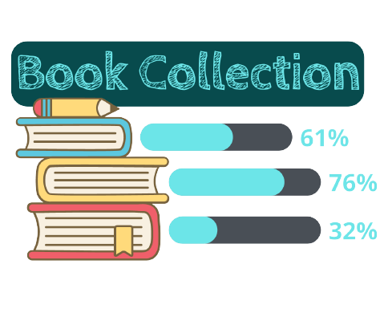

<h1 align="center">
  
</h1>

<h1 align="center">
  📚Personal Book Collection
</h1>

## Final App Project from Programming Web and Mobile Course (Distance Learning) from the Instituto Federal de Educação, Ciência e Tecnologia de São Paulo - IFSP

The personal book collection application is for you to organize the books you are currently reading. Similar to a bookmark, however the application offers you a more sophisticated form of organization, showing the percentage of what has already been read and an image of the book registered in the list.

  <a href="#Technologies-used">Technologies</a>&nbsp;&nbsp;&nbsp;|&nbsp;&nbsp;&nbsp;
  <a href="#Features-and-desired-features-in-the-future">Features</a>&nbsp;&nbsp;&nbsp;|&nbsp;&nbsp;&nbsp;
  <a href="#Translation">Translation</a>

<h1 align="center">
  
</h1>

## Technologies used
- Ionic Cordova
- Typescript
- Javascript
- HTML
- SCSS

## Features and desired features in the future
- [x] Add Book
    - [x] Name
    - [x] ISBN
    - [x] Cover
    - [x] Total pages
    - [x] Total pages read
- [x] Update Book
- [x] Book Deletion
- [ ] Search of the ISBN through API (from Google Books, for instance) reading the barcode 
    - [ ] After the search, automatically add the book information
- [ ] Sort books
- [ ] Gallery from the book read
- [ ] Statistics based by year, month, day, etc

## Translation
- [Portuguese `pt-BR`](README.md)
- [English `en`](README.en.md)