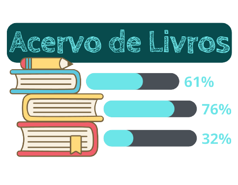

<h1 align="center">
  
</h1>

<h1 align="center">
  📚Acervo Pessoal de Livros
</h1>

## App Projeto final do Curso de Programação Web e Mobile (Ensino à Distância) do O Instituto Federal de Educação, Ciência e Tecnologia de São Paulo - IFSP

O aplicativo de acervo pessoal de livros serve para você organizar os livros que está lendo no momento. Parecido com um marcador de página, no entanto o aplicativo lhe oferece uma forma mais sofisticada de organização, mostrando a porcentagem do que já foi lido e imagem do livro cadastrado na lista.

  <a href="#Tecnologias-utilizadas">Tecnologias</a>&nbsp;&nbsp;&nbsp;|&nbsp;&nbsp;&nbsp;
  <a href="#Funcionalidades-e-futuras-funcionalidade-desejadas">Funcionalidades</a>&nbsp;&nbsp;&nbsp;|&nbsp;&nbsp;&nbsp;
  <a href="#Tradução">Tradução</a>

<h1 align="center">
  
</h1>

## Tecnologias utilizadas
- Ionic Cordova
- Typescript
- Javascript
- HTML
- SCSS

## Funcionalidades e futuras funcionalidade desejadas
- [x] Cadastro de Livro
    - [x] Nome
    - [x] ISBN
    - [x] Capa
    - [x] Total de páginas
    - [x] Total de páginas lidas
- [x] Atualização do livro
- [x] Remoção do livro
- [ ] Busca de ISBN via API (do Google Livros, por exemplo) usando código de barras
    - [ ] Após busca, inserção automática dos dados do livro
- [ ] Alterar ordem dos livros
- [ ] Galeria dos livros lidos
- [ ] Estatísticas baseadas por ano, mês, dia, etc

## Tradução
- [English `en`](README.en.md)